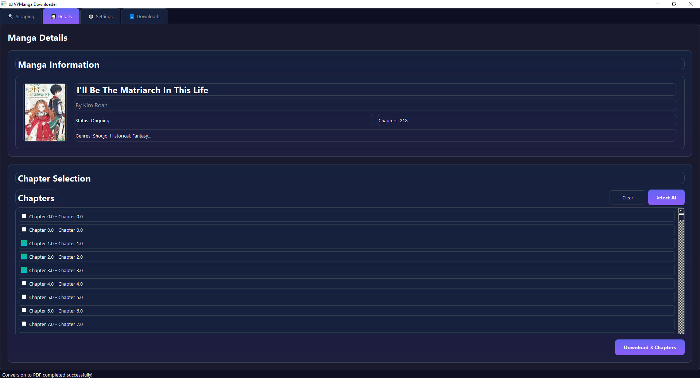

# 📖 VYManga Downloader

A modern, powerful, and elegant manga downloader with both **interactive CLI** and a **mind-blowing GUI**.

**VYManga Downloader** is your ultimate solution for downloading manga from vymanga.co with a beautiful, user-friendly interface. Whether you prefer the command line for quick downloads or a sleek graphical interface with smooth animations, this tool has you covered. Built with Python and PyQt6, it features multi-threaded downloads, format conversion to PDF/CBZ, and a modern dark-themed GUI that makes manga downloading a delightful experience.


## 🎨 GUI Preview



*The modern, dark-themed GUI interface with tabbed navigation and smooth animations*


## ✨ Features

### 🎯 Dual Interface Experience
- **Interactive CLI**: Clean, guided prompts for terminal lovers
- **Modern GUI**: Sleek, animated interface for casual users

### 🚀 Core Functionality
- **Robust Scraping**: Reliable metadata and chapter fetching from vymanga.co
- **Fast Downloads**: Multi-threaded downloads with configurable concurrency
- **Flexible Selection**: Single chapter, multiple chapters, or full manga download
- **Format Conversion**: Convert to PDF and CBZ formats
- **Resume Support**: Resume interrupted downloads
- **Modern UI**: Dashboard-style interface with smooth animations and dark theme

### 🎨 GUI Features
- **Dashboard Layout**: Clean, organized interface with sidebar navigation
- **Animated Cards**: Beautiful manga cards with cover art and metadata
- **Download Manager**: Real-time progress tracking with pause/resume controls
- **Modern Design**: Dark-first theme with gradients, rounded corners, and smooth transitions
- **Responsive UI**: Background workers keep the interface responsive during long operations

## 📦 Installation

### Prerequisites
- Python 3.8 or higher
- pip package manager
- Git (for cloning)

### Clone the Repository
```bash
# Clone the repository
git clone https://github.com/Yui007/vymanga-downloader.git

# Navigate to the project directory
cd vymanga-downloader

# Create a virtual environment (recommended)
python -m venv venv

# Activate the virtual environment
# On Windows:
venv\Scripts\activate
# On macOS/Linux:
source venv/bin/activate

# Install all dependencies
pip install -r requirements.txt

# For GUI mode, PyQt6 will be installed automatically
```

### Alternative Installation (without Git)
```bash
# Download the ZIP from GitHub
# Extract to a folder
# Navigate to the project directory
cd vymanga-downloader

# Create virtual environment
python -m venv venv

# Activate and install
venv\Scripts\activate  # Windows
# source venv/bin/activate  # macOS/Linux
pip install -r requirements.txt
```

### 📖 Usage Guide

#### CLI Mode (Default)
```bash
# Interactive mode with guided prompts
python main.py

# Quick download with command line arguments
python main.py --url "https://vymanga.co/manga/example" --format pdf --range 1 10

# Show all available options
python main.py --help
```

### GUI Mode
```bash
# Launch the modern GUI interface
python main.py --gui
```

### Command Line Options

| Option | Description | Example |
|--------|-------------|---------|
| `--url` | Manga URL from vymanga.co | `--url "https://vymanga.co/manga/example"` |
| `--range START END` | Chapter range | `--range 1 10` |
| `--chapter N` | Single chapter | `--chapter 5` |
| `--format` | Output format | `--format pdf` (images/pdf/cbz) |
| `--quality` | Image quality | `--quality high` (high/medium/low) |
| `--output` | Download directory | `--output "/path/to/downloads"` |
| `--workers` | Download threads | `--workers 4` |
| `--gui` | Launch GUI mode | `--gui` |
| `--verbose` | Verbose logging | `--verbose` |

## 🎨 GUI Interface

The GUI provides a modern, tabbed interface with beautiful animations and a dark theme:

- **4-Tab Layout**: Clean organization with dedicated tabs for each function
- **Scraping Tab**: Enter manga URLs and fetch information
- **Details Tab**: View manga information, cover art, and select chapters
- **Settings Tab**: Configure download preferences and quality settings
- **Downloads Tab**: Real-time progress tracking and download management
- **Status Bar**: Real-time status updates and progress indicators

### Interface Features
- 🎨 **Modern Design**: Dark-first theme with gradients and smooth animations
- 📱 **Responsive Layout**: Clean, organized interface that adapts to window size
- ⚡ **Background Processing**: Non-blocking operations keep UI responsive
- 🎯 **Intuitive Navigation**: Tabbed interface for easy workflow management
- 📊 **Progress Tracking**: Real-time download progress with detailed status

## 🔧 Configuration

### Download Settings
- **Parallel Workers**: Number of concurrent download threads (1-5)
- **Image Quality**: High/Medium/Low quality for downloads
- **Output Format**: Images, PDF, or CBZ
- **Download Path**: Custom directory for downloads

### GUI Settings
- **Theme**: Dark/Light mode (dark is default)
- **Animations**: Enable/disable smooth transitions
- **Window Size**: Resizable main window (minimum 1200x800)

## 📁 Project Structure

```
vymanga-downloader/
├── main.py              # Entry point (CLI/GUI)
├── cli.py               # Interactive CLI interface
├── gui.py               # PyQt6 GUI application
├── scraper.py           # Web scraping engine
├── downloader.py        # Multi-threaded downloads
├── converter.py         # Format conversion (PDF/CBZ)
├── models.py            # Data structures
├── utils.py             # Utilities and helpers
├── styles.py            # GUI theming and animations
├── gui_main_window.py   # Main GUI window
├── gui_widgets.py       # Custom GUI components
├── gui_workers.py       # Background worker threads
├── requirements.txt     # Dependencies
├── test.py              # Test suite
└── README.md           # This file
```

## 🛠️ Development

### Running Tests
```bash
python test.py
```

### Code Structure
- **Backend**: `scraper.py`, `downloader.py`, `converter.py`
- **CLI**: `cli.py`, `main.py`
- **GUI**: `gui.py`, `gui_main_window.py`, `gui_widgets.py`, `gui_workers.py`, `styles.py`
- **Core**: `models.py`, `utils.py`

### Adding New Features
1. Backend features go in the appropriate module
2. GUI features need updates to `gui_main_window.py` and `gui_widgets.py`
3. Both interfaces should support new functionality

## 🔍 Troubleshooting

### Common Issues

**Import Errors:**
```bash
# Make sure all dependencies are installed
pip install -r requirements.txt

# For GUI issues, try reinstalling PyQt6
pip uninstall PyQt6 PyQt6-sip
pip install PyQt6 PyQt6-sip
```

**Scraping Issues:**
- Check if the manga URL is valid and accessible
- Some manga sites may have anti-bot protection
- Try reducing the number of parallel workers

**Download Issues:**
- Check your internet connection
- Verify the download directory has write permissions
- Try using a different image quality setting

### Debug Mode
```bash
# Enable debug logging
python main.py --debug --verbose
```

## 📄 License

MIT License - see LICENSE file for details.

## 🤝 Contributing

1. Fork the repository
2. Create a feature branch
3. Make your changes
4. Test thoroughly (both CLI and GUI)
5. Submit a pull request

---

**VYManga Downloader** - Modern manga downloading made beautiful and easy! 🎉